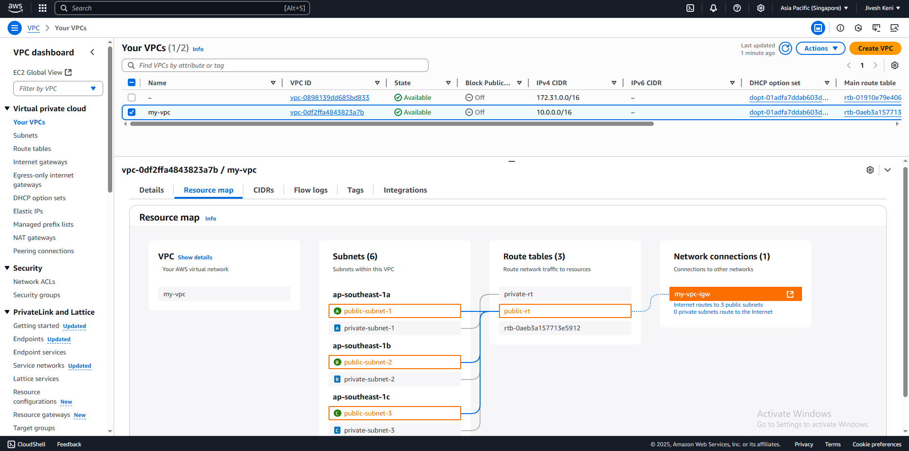
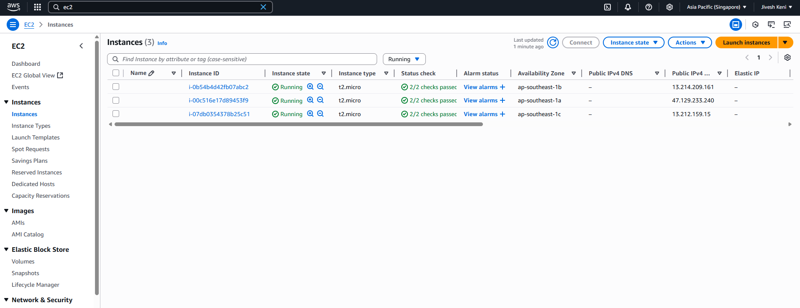
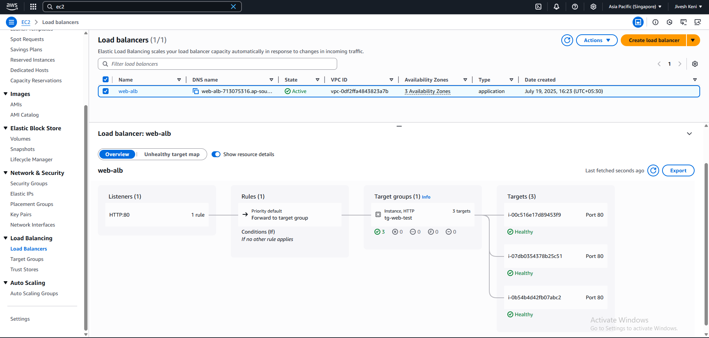
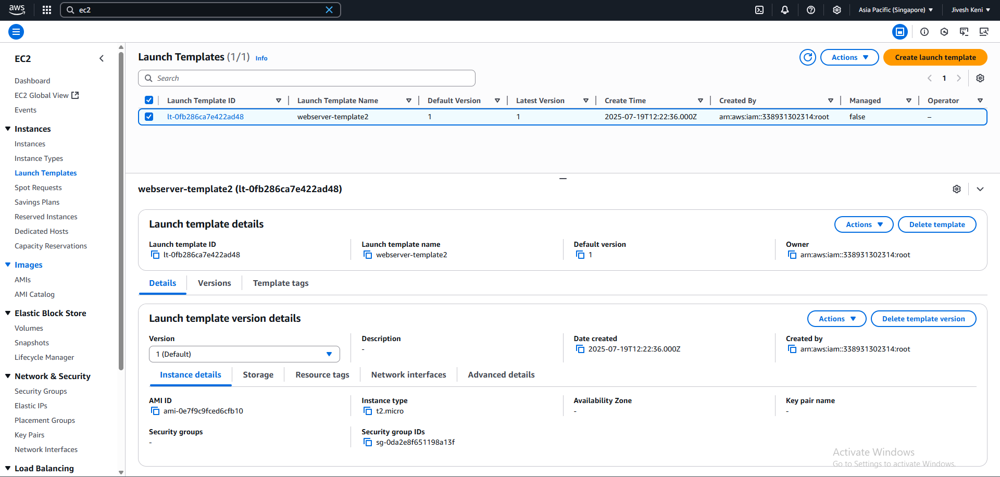
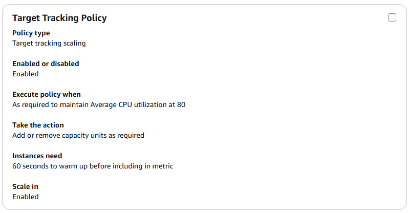

# ☁️AWS Auto Scaling Architecture with Load Balancer & Secure VPC☁️

This project demonstrates a secure, highly available, and scalable AWS infrastructure. It includes a custom VPC with public and private subnets, an Application Load Balancer (ALB), and an Auto Scaling Group (ASG) that dynamically manages EC2 instances based on CPU usage.

---

## 📚 Project Summary

| Feature | Details |
|--------|---------|
| **VPC** | Custom VPC with 3 public and 3 private subnets split across 3 Availability Zones for High availability |
| **Internet Gateway** | Attached to public subnets for external access |
| **Route Tables** | Public subnets route `0.0.0.0/0` through IGW; private subnets use internal routing only |
| **Launch Template** | Specifies AMI, instance type, user data, and SGs |
| **Auto Scaling Group (ASG)** | Automatically launches EC2 instances in public subnets to serve traffic via the ALB |
| **Load Balancer (ALB)** | Distributes incoming traffic evenly across public EC2 instances in multiple Availability Zones |

---

## 📸 Screenshots

| Feature | Screenshot |
|--------|------------|
| **VPC setup** |  |
| **Autoscaled EC2 instances split across AZ** |  |
| **Load Balancer with Target Group** |  |
| **Auto Scaling Group Launch Template** |  |
| **Auto Scaling Group Policy (CPU Tracking)** |  |

---

## 🔒 Security Group Configuration

| Component | Inbound Rules | Notes |
|----------|----------------|-------|
| **Application-load-balancer SG** | HTTP (80) from anywhere (`0.0.0.0/0`) | Only public entry point |
| **Auto-scaling-group SG** | HTTP (80) from ALB SG only | No public access |
| **SSH Access** | **Disabled** from public | SSH access was temporarily done using a Bastion host |

---

## 📖 How it Works
- Users access the website via the ALB DNS name.
- ALB forwards requests to EC2s in the ASG.
- ASG ensures enough EC2s run based on load.
- Subnets and routing are designed for High Availability and security.

---

## 🚀 Future Improvements

- **Bastion Host Setup**  
  Currently omitted from final architecture screenshots to reduce resource usage, but SSH access during testing was done through a Bastion host launched in a public subnet with restricted access via Security Groups.

- **Infrastructure as Code (IaC)**  
  Future versions will include **Terraform** scripts to define and provision this entire infrastructure automatically.

- **Private Subnet NAT Access**  
  Introducing **NAT Gateway** Although not included in the final setup to remain within the AWS Free Tier, introducing a **NAT Gateway** is a planned improvement to allow instances in private subnets to securely access the internet
  
---
